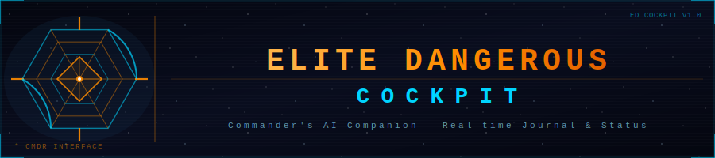
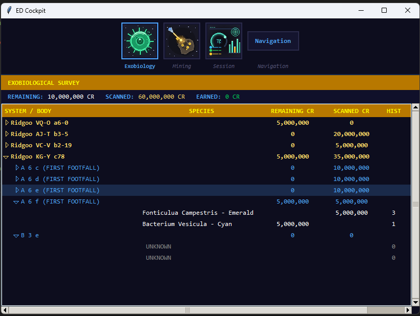
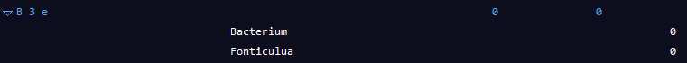
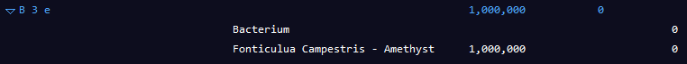
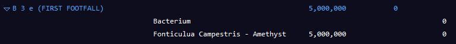
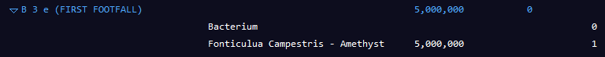

  

# ED Discovery Roles User Guide

This section presents roles included in ED Cockpit by default

---

## Table of contents

1. [Exobiology Role](#exobiology-role)
2. [Mining Role](#mining-role)
3. [Session Status Role](#session-status-role)
4. [Navigation Role](#navigation-role)

## Exobiology Role

Exobiology Role intends to monitor and keep track of an exobiology session, persistent between several systems and different game sessions.
It have been designed to help you knowing which samples you have on board and for which possible maximum value.

When running a long session (sometimes weeks long) having a clue of what you have actually achieved is important as if your ship is destroyed, you will loose all datas that have not been sold yet.

When reaching a key value it will help you decide to pause at the closest Vista Genomics, or call back your FC, to sell those datas.

Also, on long session, keeping a track of all achievements is motivating I feel.

Currently, data is only cleared at time you sell your datas.

Here is how it looks :

  

Fields are self explaining, but here is a short abstract : 
- **REMAINING** : The amount of species you have qualified, but not scanned yet.
- **SCANNED** : The amount you have currently fully scanned.
- **SYSTEM/BODY** : Column showing System or Body names. "(FIRST FOOTFALL)" is added if a first footfall was possible and you disembaraked at this body. 
- **SPECIES** : Column showing the Specie name. Can range from "UNKNOWN" to full specie name depending on the scans you have done. (see later)
- **REMAINING CR** : Possible value for unscanned species. This apply both for species unit value (when fully identified) and for body (sum of all species unit value). If the body was first footfalled, a x5 multiplier is done.
- **SCANNED CR** : Value of done scan.
- **HIST** : number of scans done
- **DONE** : Is missing on snapshots but contains "Y" as soon as you complete 3 scans of species. Only appear on species rows.

### About table rows

All rows may be collapsed or expanded.

Master rows (ie. Ridgoo VQ-O a6-0) are the system names you explored with exobiology signals in your trip.
Sub-rows are bodies having exobiology signals in this system.
For each body, one sub-row will be added for each specie existing on that body.

In previous snapshot ony one system is expanded, where only 2 bodies are as well. You may collapse/expand at any time, knowing it is entirely manual.
Expanded status of items is not stored in context, so when you start a new client, all items will be expanded by default. All along your session, it then stays persistant so that if you find another system it is added to the table without changing previous items expand state.

### Dynamic discovery states

#### System advanced scan

When arriving on a brand new System you have to run an advanced scan of its bodies. If a body contains biological signals, the a System row is created and the body is added as a sub item, with a number of sub rows matching the number of signals found. Those species entries are initialized with the species as "UNKNOWN". See "B 3 e" body in previous snapshot. We will continue with B3e to illustrate this topic

#### Surface scan

When reaching a body and doing a Surface scan we populate the generic name of the specie, the only one currently known. Here is an example with "B 3 e" when surfaced scanned :

  

#### Content scan / Codex entry

As flying the surface, when you see a specie and do a content scan from your ship (or SRV if on the ground), full specie name is found, and its value retrieved. Here is now "B 3 E" as a codex entry was generated on one of the species :

  

#### Disembarking

As soon as you disembark on the planet by foot, if there is a possibility for first footfall, then it will be indicated and species value will recieve a x5 multiplier. This will apply to all species on this body

  

#### Exobiology scanning

At that time we start to record scans. If you had not done Content scanning before, it's at that time that your specie full name and its value will be recorded.

  

#### Final note about First Footfalls

First Footfall does not guarantee you will earn the x5 multiplier at Vista Genomics. It is just an indication that you could be the first to resell this data as nobody footfalled that body. If someone else lands after you, but is the first one to sell data, then he will have that bonus, and you won't.

However, we considered this 5x multiplier as our goal is to have a watchdog on the maximum possible data value saying us "take care... do not take too much risks now ; you could lost your scanned data value..."

## Mining Role

Under Design

## Session Status Role

Under Design

## Navigation Role

Under Design
