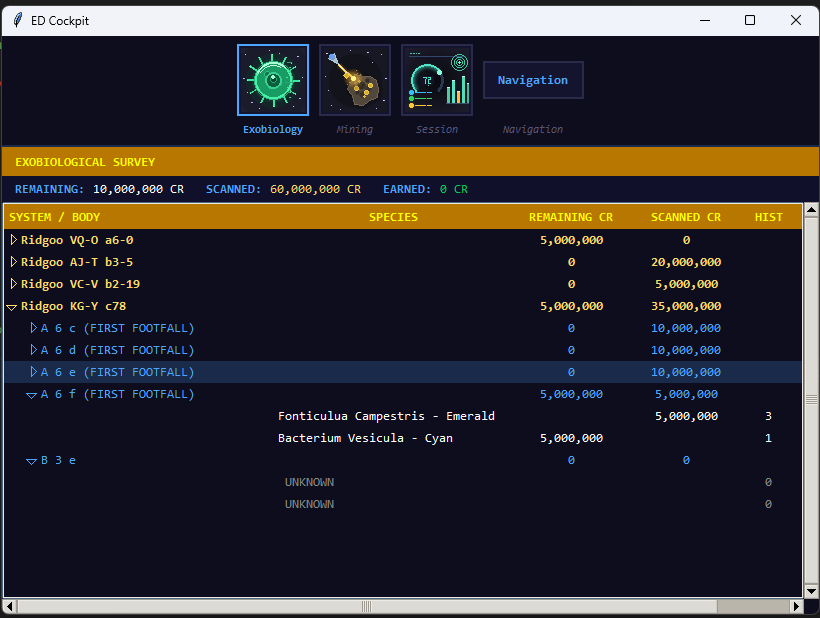
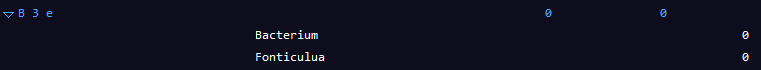
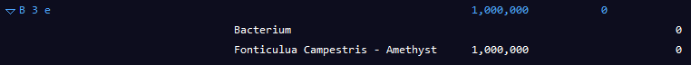
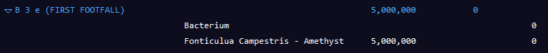
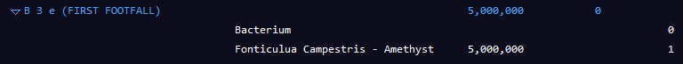
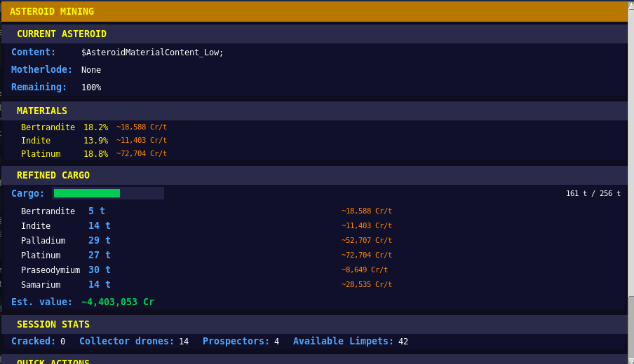
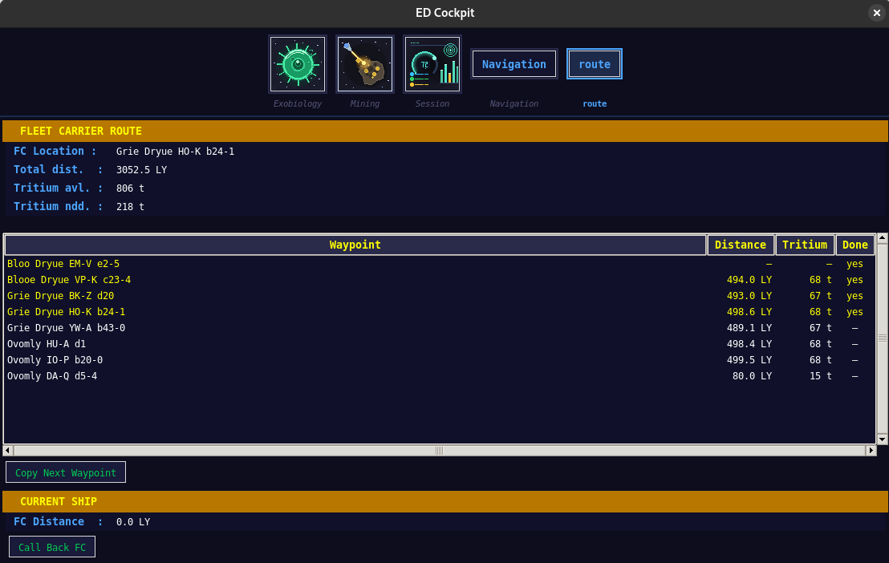
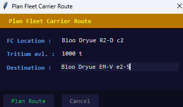

  

# ED Discovery Roles User Guide

This section presents roles included in ED Cockpit by default

---

## Table of contents

1. [Exobiology Role](#exobiology-role)
2. [Mining Role](#mining-role)
3. [Session Status Role](#session-status-role)
4. [Navigation Role](#navigation-role)
5. [Route Role](#route-role)

## Exobiology Role

Exobiology Role intends to monitor and keep track of an exobiology session, persistent between several systems and different game sessions.
It have been designed to help you knowing which samples you have on board and for which possible maximum value.

When running a long session (sometimes weeks long) having a clue of what you have actually achieved is important as if your ship is destroyed, you will loose all datas that have not been sold yet.

When reaching a certain value and you feel the loss risk starts to be too high (ie. having 1B CR or more on board) it will help you decide to pause at the closest Vista Genomics, reach or call back your FC, to sell those datas and secure your revenues. There is nothing more frustrating than loosing days or weeks of session results due to a crash...

Also, on long exobiology track, keeping a visibility of all achievements is motivating I feel.

Currently, data is only cleared at time you sell your datas.

Here is how it looks :

  

Fields are self explaining, but here is a short abstract : 
- **REMAINING** : The amount of species you have qualified, but not scanned yet.
- **SCANNED** : The amount you have currently fully scanned.
- **SYSTEM/BODY** : Column showing System or Body names. "(FIRST FOOTFALL)" is added if a first footfall was possible and you disembaraked at this body. 
- **SPECIES** : Column showing the Specie name. Can range from "UNKNOWN" to full specie name depending on the scans you have done. (see later)
- **REMAINING CR** : Possible value for unscanned species. This apply both for species unit value (when fully identified) and for body (sum of all species unit value). If the body was first footfalled, a x5 multiplier is done.
- **SCANNED CR** : Value of done scan.
- **HIST** : number of scans done
- **DONE** : Is missing on snapshots but contains "Y" as soon as you complete 3 scans of species. Only appear on species rows.

### About table rows

All rows may be collapsed or expanded.

Master rows (ie. Ridgoo VQ-O a6-0) are the system names you explored with exobiology signals in your trip.
Sub-rows are bodies having exobiology signals in this system.
For each body, one sub-row will be added for each specie existing on that body.

In previous snapshot ony one system is expanded, where only 2 bodies are as well. You may collapse/expand at any time, knowing it is entirely manual.
Expanded status of items is not stored in context, so when you start a new client, all items will be expanded by default. All along your session, it then stays persistant so that if you find another system it is added to the table without changing previous items expand state.

### Dynamic discovery states

#### System advanced scan

When arriving on a brand new System, after initial scan, you have to run an advanced scan of its bodies. If a body contains biological signals, then a System row is created and the body is added as a sub item, with a number of sub rows matching the number of signals found. Those species entries are initialized with the species as "UNKNOWN". See "B 3 e" body in previous snapshot. We will continue with B3e to illustrate this topic

#### Surface scan

When reaching a body and doing a Surface scan we populate the generic name of the specie, the only one currently known. Here is an example with "B 3 e" when surfaced scanned :

  

### Content scan / Codex entry

As flying the surface, when you do content scan of a specie from your ship (or SRV if on the ground), full specie name is found, and its value retrieved. Here is now "B 3 E" as a codex entry was generated on one of the species :

  

### Disembarking and First Footfall

If you directly disembark and scan the specie without previous content analysis, full specie name and value will be updated as well.

As soon as you disembark on the planet by foot, if there is a possibility for first footfall, then it will be indicated and species value will recieve a x5 multiplier. This will apply to all species on this body

  

See final note about First Footfalls, as this is value bonus cannot be 100% garanteed.

#### Exobiology scanning

At that time we start to record scans. If you had not done Content scanning before, it's at that time that your specie full name and its value will be recorded.

  

#### Final note about First Footfalls

First Footfall does not guarantee you will earn the x5 multiplier at Vista Genomics. It is just an indication that you could be the first to resell this data as nobody footfalled that body before you did. If someone else lands after you, but is the first one to sell data, then he will have that bonus, and you won't. Ther is a samll risk for race condition but we have no way to predict that possibility.

So, we considered this 5x multiplier for any first footfalled body as our goal is to have a watchdog on the maximum possible data value on board indicating us "take care... do not take too much risks now ; you could lost the scanned data value achieved in your past days/weeks of exobiology trip..."

Back to [Table Of Contents](#table-of-contents)

## Mining Role

The aim of the mining role is to help you to improve your mining sessions efficiency.\
This panel gives you informations about number of limpets, current asteroid content and value as well as values related to refined cargo and available cargo space.

When arriving in a hotspot, it's difficult to know how much limpets we need for perfect efficiency, nor precisely all the commodities we could mine except the one flagged as "hotspot", even on a pristine ring.\
It may happen that we fill our cargo, and need to abandon some cargo to grab as much as possible of our priority commodities, typically by dropping limpets to free cargo space.\
When running several mining sessions on a same hotspot, the first instance is used to evaluate the best number of drones we will need to be efficient for the next ones.

Also, the prices information are both of an helper and a watchguard.\
If we need to drop something to free space, the unit price of refined cargo items may help making a choice about what to drop or not.\
As well, you may know the current value of  your refined cargo. This as well is a watchguard so you may decide stopping taking risks at a certain cargo value limit. (ie. in difficult core mining sessions)

Following snapshot comes from an on-going session.
Ship was "Hephaistos", a LakonMiner T11 Prospector, with 256 T of available cargo.\
Session was started with 60 available limpets.\
It was done in a Platinum metallic ring hotspot.

  

- **CURRENT ASTEROID :** Contains stats about last prospected Asteroid.It indicates the **material** content, **motherlode** as core commodity is found (if any - none in our case), **Remaining** materials that is in fact the initial material percentage. 
- **MATERIALS** : The list of available commodities with their localized name, their percentage and their average price for current month. (see note about prices thereafter). Color code of the materials depends on their percentage : **grey** under 10%, **Yellow** between 10 and 19%, **Green** if more than 20%.
- **REFINED CARGO**: 
    - First comes **Cargo** indications. The slider is a visual indication of the cargo space used. Its color code is **Green** under 70%, **Yellow** between 70% and 89% and **Red** after 90%.  At end of line, is the precise amount of cargo usage.
    - Then comes the list of currently refined materials/commodities. They indicate the localized name, amount in cargo, and the cureent month avarage price. This is a unit, per ton, price.
    - Last comes the total estimated value of current cargo.
- **SESSION STATS** : There is a **Cracked** indicator in case you are core mining so to help you estimate your efficiency in terms of drone usage.Then we have three limpets counters : **Collector drones** is the number of limpets you currently used as collectors. **Prospectors** is the same for limpets used as prospectors. *Available limpets** are those that are remaining in cargo. Those counters let you evaluate efficiency of your session but also richness of current hotspot. In the example, just 4 prospectors and 14 collectors let us mine 105 T of interesting things. This hotspot was a really rich one
- **QUICK ACTIONS** : This is not really seen in the snapshot but those are buttons that would send commands to **Elite Dangerous** such as next/previous firegroup, deploy cargo hatch, boost, etc... Ignore this as it will disappear and will be grouped in a dedicated **Actions** role later on.

### About average monthly prices.
Commidity prices are grabbed from Ardent API, with Inara as a backup, once a month. We obtain Average and Max sell price at time of request, but only use Average price. Reason is that by respect to the community we did not wanted to overload their proposed services with continuous requests. Also, average prices are moving slowly enough to be somewhat meaningfull during one month. We are not talking about market station prices in real time here.\
Once those prices are obtained, we cache them in a persistent file with a time stamp. Each time you run the agent, it checks this time stamp vs. current date, and either use the cache file, or regenerate it from Ardent/Inara if older than one month.

### About Selling, transferring to FC or dropping commodities.
Obviously, if you transfer refined commodities they will be removed from your cargo. This covers FC cargo and tritium reserve transfers.\
Same thing as buying/selling limpets in the advanced mùaintenance of your ship.\
As well dropping commodities will decrease cargo and eventually limpets count.

When you have your cargo full, and your refinery is full as well with several trays at 100%, if you empty your cargo, even partially, all possible trays at 100% will be automatically added to your cargo by Elite Dangerous. ED Cockpit see that, and update your cargo and refined materials accoringly. That is also a reminder that your cargo is not totally empty so you may transfer new stuff in case you had not pay attention to that and would think your cargo is empty. (It happens to me seome times...)

Back to [Table Of Contents](#table-of-contents)

## Session Status Role

Under Design

Back to [Table Of Contents](#table-of-contents)

## Navigation Role

Under Design

Back to [Table Of Contents](#table-of-contents)

## Route Role

**Note** : I guess I should rename this Role at a time, perhaps as "**fleet carrier route**" or something like that.

This role is intended as a tool for Fleet Carrier based exploration.
It provides a way to compute and adjust a Fleet Carrier multi-waypoints route and coordinate your explorer or other current ship with this route.
The route computation is done using [CMDR Spansh API](https://www.spansh.co.uk/fleet-carrier). Thanks to him and all the contributors of this wonderfull resource.\
Once a route is computed, you may launch some explorer to scout and explore between waypoint. At any time, from the client, you can copy next waypoint to ED Cockpit agent clipbord, so Elite Dangerous clipboard as well.\
As well, if getting away of the route with your current ship you may use this to bring back your explorer to the correct route. At the reverse, you may also get your explorer current ship position, in case you would need to call back your fleet carrier.\
In exemple, if you are 250 LY from your carrier and your on board miner but find very interesting things to mine, so need to send your FC/Miner to reach that initially un-planed system. 

This role is displayed both on the agent window and on the client window role frame. Difference is that the agent has a **New Route** button that the client does not have.

There are two reasons why only the agent has that button :
- Client have been planned to be as light as possible, with no other logic than the ones required for managing events to/from the agent, and displaying those informations. Do not forget clients are planned to run on very low profile devices (ie. Raspberry PI, old laptops, whatever).
- Also clients could be built with little and inexpensives touch screen (ie. 7" screens) and could not have any keyboard available. Inputing a system name on such a small touchscreen with on display keyboard could be a nightmare.

Here is a client snapshot (so no "New Route" feature/button available)

  

### FLEET CARRIER section.

This section displays all informations about your Fleet Carrier and the current active route if any has been planned.

- **FC Location** : Current System of your Fleet Carrier.
- **Total dist;** : Distance remaining between current poistion of the FC and the destination wypoint. Is updated when FC jumps.
- **Tritium avl.** : Current Tritium in your FC reservoir. Updated as FC jumps as well.
- **Tritium ndd.** : Tritium needed to reach destination waypoint from current FC position. Updated as FC jumps.
- **Waypoint table** : Informations about how you did progress on your FC route.
  - **color code** : Lines in **Yellow** means you passed this waypoint. Lines in **Grey** are waypoints still to be done.
  - **Waypoint colummn** : The name  of the waypoint system.
  - **Distence** column : Distance between previous waypoint and this one.
  - **Tritium** column : Amount of Tritium needed to reach this waypoint from the previous. Is defined at route planning time, from FC cargo usage at that time.
  - "Done" column : Indicates if the FC has passed or reach this waypoint.
- **Copy Next Waypoint** : When pressed on the **client**, it will send a message to the **agent** running on the same platform than the game. The **agent** will then copy the next waypoint to the clipboard. So to send your FC to next waypoint, or to plan a route for your explorer/scout, you simply press this button and paste directly in the appropraite map search field in the game. This button also exists in the **agent** window, so the same action may be achieved from there as the context is manageed by the **agent** so it directly copy the next waypoint to the clipboard. 

### CURRENT SHIP section

Currently, this section is somewhat minimal. That could change in time.
It only indicates the distance beween your current ship and the fleet carrier
and proposes a **Call Back FC** button.

- **FC Distance** : Is very usefull when exploring outside of the route and wishing to call the FC to jump in current ship System. I ever mentioned a use case where we find useful resources we want to mine between waypoints.\
Another one is when your final waypoint is not as convenient\
(ie. no refuel star, time to mine some tritium but no interesting ring there, no bodies in system and you do not want to have your FC arriving close to the main start, or whatever) so you change your mind to jump at another close by system.\
FC Distance is a way to check that you are still in the 500 LY range your FC can jump when wishing to call it back.
- **Call Back FC** button : Simply copy the ship current system location in game clipboard in the same way than previously for next waypoint. Just go to the Galaxy Map from FC management in game and copy to the search system.\
**Warning :** Your FC will have no issue reaching your ship current system.\
However, You will need to recompute/adjust the route so it is updated from new FC location after the jump as distances could change.\
In that case, if this system is a one you first discovered, it won't be in **spansh** database. So **you will need to register your system by declaring it to Universal Cartographics before replanning your route.**\
Once done, you can either wait for **spansh** update (24 hours I guess), or do a manual search of this system on **spansh** to make it aware of its discovery.

### Planning/Adjusting a route

This is done by pressing a **New Route** button located in the **agent** (only) window **route** tab. This button is located in the **FLEET CARRIER** section, just before the **Copy Next Waypoint** button.\
Here is a snapshot of the popup that appears.

  

This snapshot was done for another route than the one presented in the client snapshot, so is not related.
- **FC Location** : This is the current FC position.
- **Tritium avl.** : Current Tritium available in FC reservoir.
- **Destination** : The target System you want to reach.

As you click **Plan Route** request is sent to **spansh** API>.\
Remember : Both current FC system and Destination System need to known from **spansh**. Seee previous warning.\
At a later stage, it is planned to integrate an automatic call to **spansh** API so to declare a newly discovered system, but that will still require declaring it to the game first by Universal Cartographics.

Back to [Table Of Contents](#table-of-contents)
